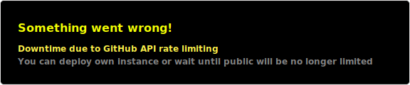

<!--
  add `-halloween` suffix to all of these on Oct 1-31
  TODO make it work somehow without manual modification?
  gha (commit on 1st and oct31) or some data="halloween" stuff?
-->
<picture>
  <source media="(prefers-color-scheme: dark)" srcset="https://raw.githubusercontent.com/phanirithvij/phanirithvij/refs/heads/output/github-contribution-grid-snake-dark.svg" />
  <source media="(prefers-color-scheme: light)" srcset="https://raw.githubusercontent.com/phanirithvij/phanirithvij/refs/heads/output/github-contribution-grid-snake.svg" />
  
</picture>

### Profile pic history

| date       | old                                                                                                | new                                                                                                   |
| ---------- | -------------------------------------------------------------------------------------------------- | ----------------------------------------------------------------------------------------------------- |
| 09/26/2024 |  |  |
